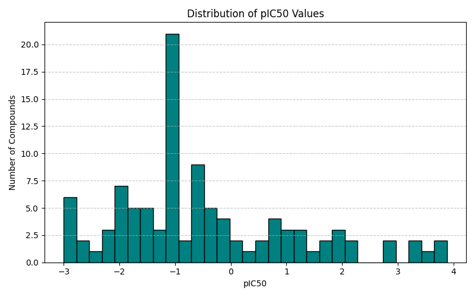
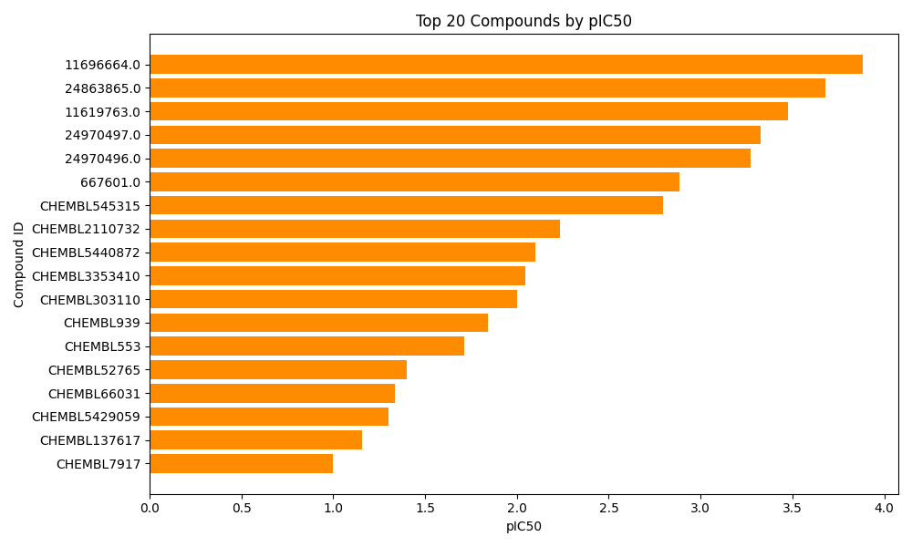
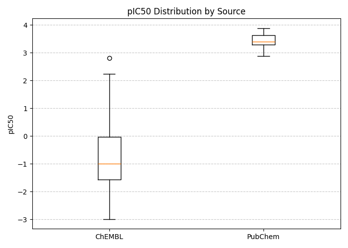

# Drug Discovery Capstone: ChEMBL & PubChem IC50 Analysis

## Overview

This project focuses on **analyzing bioactivity data from ChEMBL and PubChem** to identify the most potent small-molecule inhibitors for a target of interest. The workflow integrates data cleaning, transformation, and visualization to generate actionable insights for drug discovery research.

The pipeline demonstrates practical skills in **data wrangling, bioinformatics, and cheminformatics** using Python.

---

## 🔹 Project Goals

1. Load and clean raw bioactivity data from ChEMBL and PubChem.  
2. Standardize potency measurements (IC50 in nM) and calculate pIC50.  
3. Combine datasets to create a unified bioactivity table.  
4. Identify top candidate compounds based on pIC50 values.  
5. Visualize the results with histograms, bar plots, and boxplots.  

---

## 🔹 Dataset

**Source:**  

- [ChEMBL](https://www.ebi.ac.uk/chembl/) – open bioactivity database  
- [PubChem](https://pubchem.ncbi.nlm.nih.gov/) – open chemical compound database  

**Files used:**  

- `chembl_raw.csv` – ChEMBL bioactivity data  
- `pubchem_raw.csv` – PubChem bioactivity data  

**Processed outputs:**  

- `chembl_clean.csv` – cleaned ChEMBL data  
- `pubchem_clean.csv` – cleaned PubChem data  
- `combined_hits.csv` – merged dataset  
- `top_candidates.csv` – top 20 compounds by pIC50  

---

## 🔹 Tools & Libraries

- Python 3  
- [pandas](https://pandas.pydata.org/) – data manipulation  
- [numpy](https://numpy.org/) – numerical calculations  
- [matplotlib](https://matplotlib.org/) – data visualization  

---

## 🔹 Workflow / Pipeline

1. **Data Cleaning**  
   - Load raw CSVs using pandas.  
   - Standardize column names and units.  
   - Convert IC50 values to numeric.  

2. **Data Transformation**  
   - Convert IC50 from nM → µM.  
   - Calculate pIC50: `pIC50 = -log10(IC50_uM)`.  

3. **Integration**  
   - Combine ChEMBL and PubChem datasets into one unified table.  

4. **Top Candidate Selection**  
   - Rank compounds by pIC50.  
   - Classify potency: Very Potent / Potent / Moderate / Weak.  

5. **Visualization**  
   - Histogram of all pIC50 values.  
   - Horizontal bar plot of top 20 compounds.  
   - Boxplot comparing ChEMBL vs PubChem distributions.  

---

## 🔹 Example Plots

- **Distribution of pIC50 Values**  
    

- **Top 20 Compounds by pIC50**  
    

- **pIC50 Comparison by Source**  
    

---

## 🔹 How to Run

1. Clone the repository:

```bash
git clone https://github.com/yourusername/drug_discovery_capstone.git
cd drug_discovery_capstone
